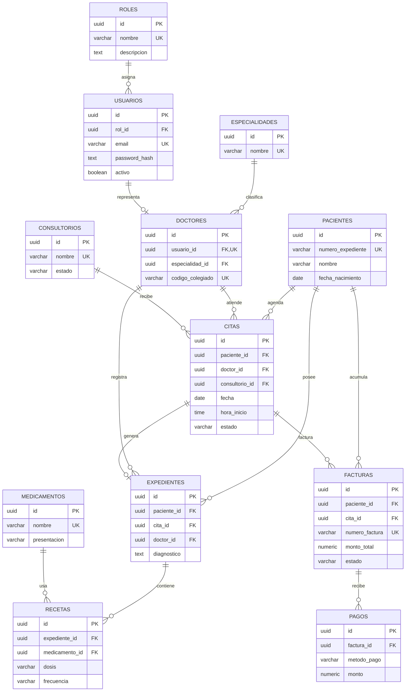

# Diagrama entidad-relacion

Este diagrama resume la estructura principal de la base de datos de `ClinicaPlus`.

```mermaid
erDiagram
    ROLES ||--o{ USUARIOS : asigna
    ESPECIALIDADES ||--o{ DOCTORES : clasifica
    USUARIOS ||--o| DOCTORES : representa
    PACIENTES ||--o{ CITAS : agenda
    DOCTORES ||--o{ CITAS : atiende
    CONSULTORIOS ||--o{ CITAS : recibe
    PACIENTES ||--o{ EXPEDIENTES : posee
    DOCTORES ||--o{ EXPEDIENTES : registra
    CITAS ||--o| EXPEDIENTES : genera
    EXPEDIENTES ||--o{ RECETAS : contiene
    MEDICAMENTOS ||--o{ RECETAS : usa
    PACIENTES ||--o{ FACTURAS : acumula
    CITAS ||--o{ FACTURAS : factura
    FACTURAS ||--o{ PAGOS : recibe

    ROLES {
        uuid id PK
        varchar nombre UK
        text descripcion
    }
    USUARIOS {
        uuid id PK
        uuid rol_id FK
        varchar email UK
        text password_hash
        boolean activo
    }
    ESPECIALIDADES {
        uuid id PK
        varchar nombre UK
    }
    DOCTORES {
        uuid id PK
        uuid usuario_id FK,UK
        uuid especialidad_id FK
        varchar codigo_colegiado UK
    }
    CONSULTORIOS {
        uuid id PK
        varchar nombre UK
        varchar estado
    }
    PACIENTES {
        uuid id PK
        varchar numero_expediente UK
        varchar nombre
        date fecha_nacimiento
    }
    CITAS {
        uuid id PK
        uuid paciente_id FK
        uuid doctor_id FK
        uuid consultorio_id FK
        date fecha
        time hora_inicio
        varchar estado
    }
    EXPEDIENTES {
        uuid id PK
        uuid paciente_id FK
        uuid cita_id FK
        uuid doctor_id FK
        text diagnostico
    }
    MEDICAMENTOS {
        uuid id PK
        varchar nombre UK
        varchar presentacion
    }
    RECETAS {
        uuid id PK
        uuid expediente_id FK
        uuid medicamento_id FK
        varchar dosis
        varchar frecuencia
    }
    FACTURAS {
        uuid id PK
        uuid paciente_id FK
        uuid cita_id FK
        varchar numero_factura UK
        numeric monto_total
        varchar estado
    }
    PAGOS {
        uuid id PK
        uuid factura_id FK
        varchar metodo_pago
        numeric monto
    }
```
